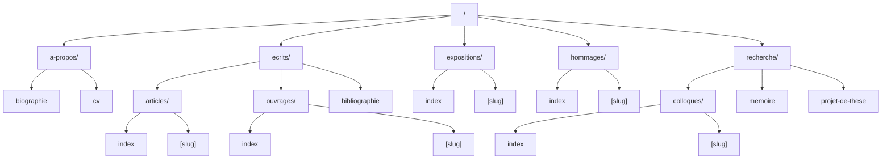

# Vanessa Noizet - Portfolio

Academic portfolio website for art historian Vanessa Noizet, built with Astro and a feature-based architecture.

## Getting Started

```bash
# Install dependencies
npm install

# Start development server
npm run dev

# Build for production
npm run build

# Preview production build
npm run preview

# Format code
npm run format
```

## Technology Stack

- **Astro** - Static site generator with TypeScript support
- **astro-typesafe-routes** - Type-safe routing with compile-time validation
- **UnoCSS** - On-demand utility class generation from design tokens
- **Open Color** - Consistent color palette system
- **GSAP** - High-performance animation library

## Architecture

### Feature-Based Structure

Components and configuration are organized by feature domains with colocated files:

```
src/features/
└── navigation/
    ├── components/
    │   ├── index.ts          # Barrel export
    │   ├── desktop-nav.astro # Public component
    │   └── _dropdown.astro   # Private component (underscore prefix)
    └── config/
        └── nav-links.ts      # Feature-specific configuration
```

**Import Pattern:**

```astro
// Feature exports via barrel file
import { DesktopNav } from '#features/navigation/components'

// Import alias (#* → ./src/*)
import BaseLayout from '#layouts/base-layout.astro'
```

**Core Directories:**

- `src/features/` - Feature modules with colocated components and config
- `src/lib/` - Shared utilities and constants
- `src/layouts/` - Page layout templates
- `src/pages/` - File-based routing
- `src/style/` - Global styles (ITCSS methodology)
- `data/` - Content collections (markdown files)

### Content Collections

Content is separated from source code in `/data/[collection]/*.md`:

```typescript
// Collections: articles, expositions, hommages, colloques, ouvrages
// Schema: { title: string, date: Date }
```

**Rendering:**

```astro
---
const { render } = await entry.render()
const { Content } = render
---

<Content />
```

### CSS Architecture

**ITCSS Layers:**

1. **Global** - CSS Custom Properties (design tokens), reset, base styles
2. **Composition** - Layout primitives (`.container`, etc.)
3. **Utilities** - Generated on-demand by UnoCSS

**Design Tokens:**

```css
/* Colors (Open Color palette) */
--clr-text, --clr-surface, --clr-accent

/* Typography (fluid scale) */
--fs--2 to --fs-7

/* Spacing (fluid scale with clamp) */
--space-3xs to --space-3xl
```

**UnoCSS Utilities:**

```html
<!-- Font sizes -->
<h1 class="fs-6">Title</h1>

<!-- Text colors -->
<p class="text-base text-accent">Text</p>

<!-- Spacing -->
<div class="mt-2xl p-s gap-l">Content</div>

<!-- Flow rhythm -->
<article class="flow-m">...</article>
```

Configuration in `uno.config.ts` maps CSS variables to utility classes.

## Routes


