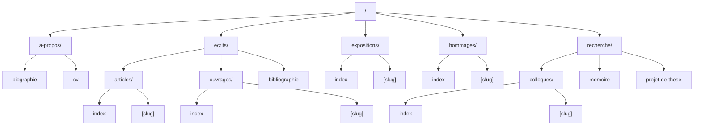

## CSS

This project uses a structured CSS architecture organized into logical layers for maintainability and scalability.

### Structure

```
src/style/
├── index.css          # Main entry point
├── global/            # Global styles and foundations
├── composition/       # Layout primitives and structural patterns
└── utilities/         # Single-purpose utility classes
```

### Layers

#### 1. Global (`global/`)

Foundation styles that apply globally:

- **variables.css**: CSS custom properties for colors, typography, and spacing
- **reset.css**: CSS reset for consistent cross-browser baseline
- **base.css**: Sensible defaults for HTML elements with optimal typography

#### 2. Composition (`composition/`)

Layout primitives and structural patterns for page composition. These are reusable layout components that handle how elements are arranged spatially.

#### 3. Utilities (`utilities/`)

Single-purpose classes for common styling needs:

- **flow.css**: Vertical rhythm utility for consistent spacing between elements
- **border.css**: Border utilities with color variations
- **text-color.css**: Text color utilities
- **font-size.css**: Font size utilities
- **margin.css**: Margin spacing utilities
- **padding.css**: Padding spacing utilities

### CSS Variables

#### Colors

Based on Open Color palette:

- `--clr-surface`: Background color (gray-0)
- `--clr-border`: Border color (gray-2)
- `--clr-border-strong`: Strong border color (gray-3)
- `--clr-divider`: Divider color (gray-4)
- `--clr-text-fade`: Faded text color (gray-5)
- `--clr-text-disabled`: Disabled text color (gray-6)
- `--clr-text`: Base text color (gray-8)
- `--clr-text-strong`: Strong text color (gray-9)
- `--clr-accent`: Accent color (yellow-8)
- `--clr-accent-fade`: Faded accent color (yellow-5)

#### Typography

- `--font-base`: Base font family (DM Serif Text)
- `--font-display`: Display font family (DM Serif Display)
- `--fs--2` to `--fs-5`: Fluid font size scale using clamp()

#### Spacing

- `--space-3xs` to `--space-3xl`: Fluid spacing scale using clamp()

### Utility Classes

#### Border

- `.border`, `.border-strong`, `.border-divider`, `.border-accent`, `.border-accent-fade`
- Directional: `.border-top`, `.border-right`, `.border-bottom`, `.border-left`
- Strong variants: `.border-top-strong`, `.border-right-strong`, `.border-bottom-strong`, `.border-left-strong`
- Reset: `.border-none`

#### Text Color

- `.text-base`, `.text-strong`, `.text-fade`, `.text-disabled`
- `.text-accent`, `.text-accent-fade`
- `.text-inherit`, `.text-current`

#### Font Size

- `.fs--2`, `.fs--1`, `.fs-0`, `.fs-1`, `.fs-2`, `.fs-3`, `.fs-4`, `.fs-5`

#### Margin

- All sizes: `.m-3xs` to `.m-3xl`
- Directional: `.mt-*`, `.mr-*`, `.mb-*`, `.ml-*`
- Axis: `.mx-*`, `.my-*`
- Reset: `.m-0`, `.mt-0`, `.mr-0`, `.mb-0`, `.ml-0`, `.mx-0`, `.my-0`
- Auto: `.m-auto`, `.mt-auto`, `.mb-auto`, `.ml-auto`, `.mr-auto`

#### Padding

- All sizes: `.p-3xs` to `.p-3xl`
- Directional: `.pt-*`, `.pr-*`, `.pb-*`, `.pl-*`
- Axis: `.px-*`, `.py-*`
- Reset: `.p-0`, `.pt-0`, `.pr-0`, `.pb-0`, `.pl-0`, `.px-0`, `.py-0`

#### Flow

- `.flow`: Applies consistent vertical rhythm between child elements using `--flow-space` variable (defaults to 1em)

### Import Order

Styles are imported in cascade order of specificity:

1. Global (variables, reset, base)
2. Composition (layout)
3. Utilities (helpers)

## Routes


